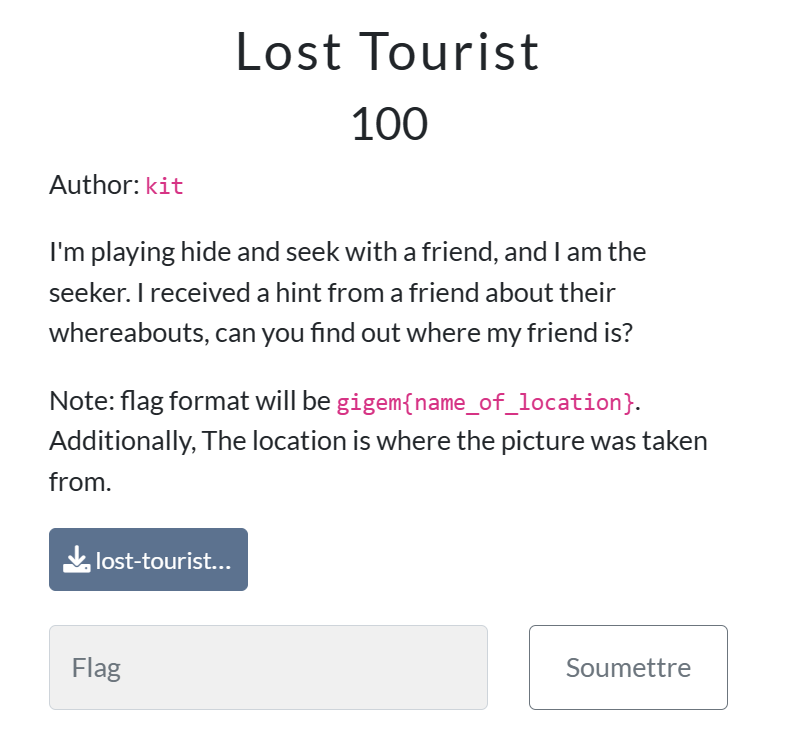
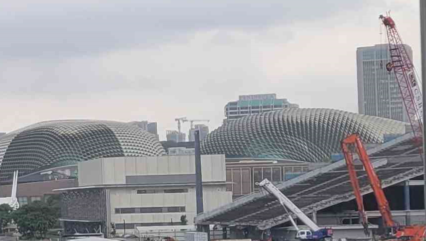
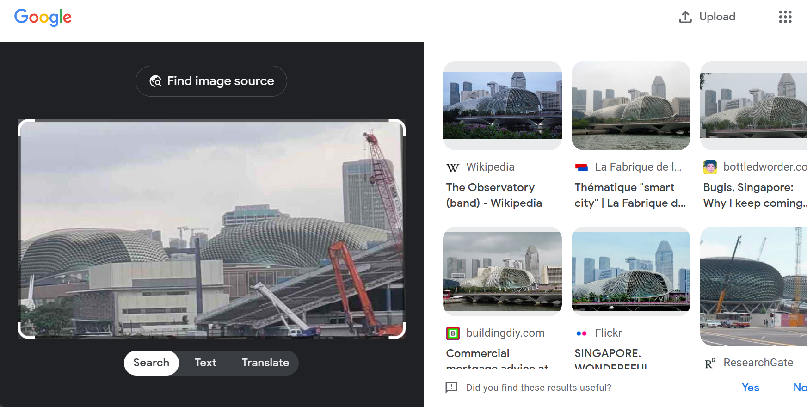
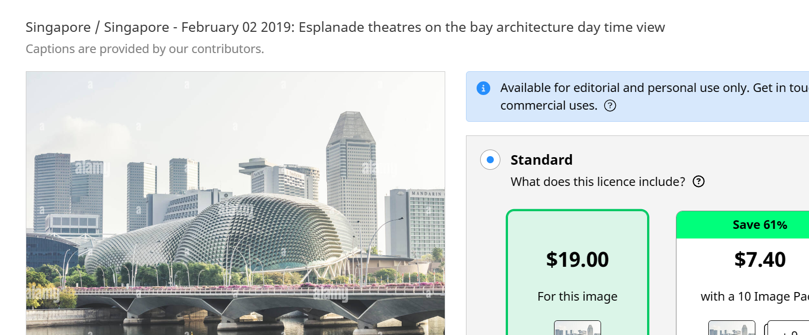
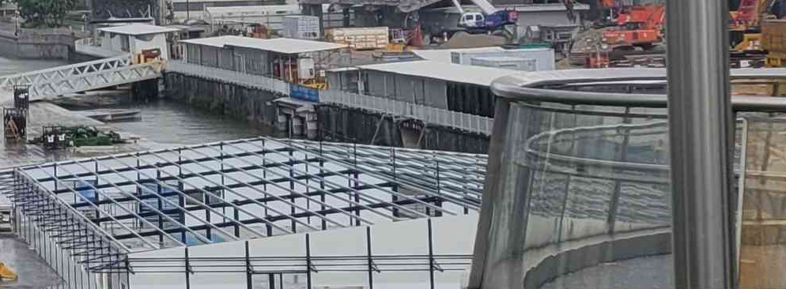
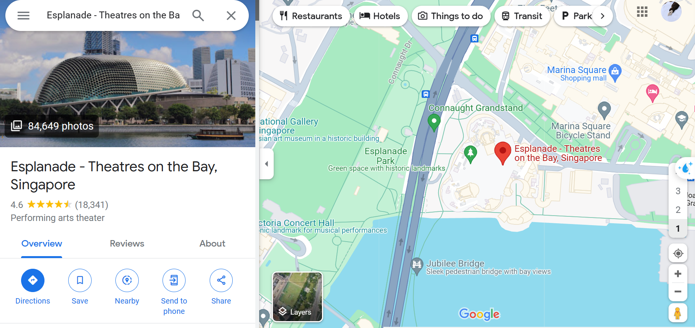
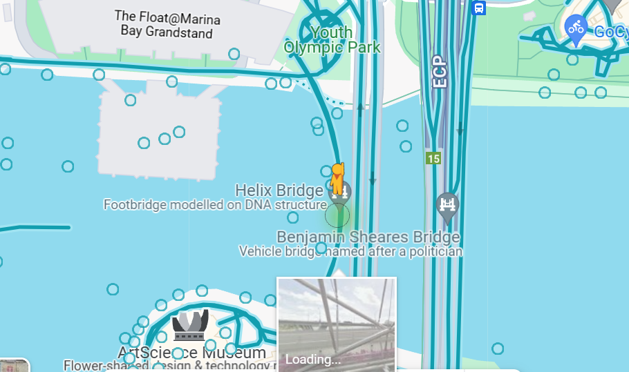
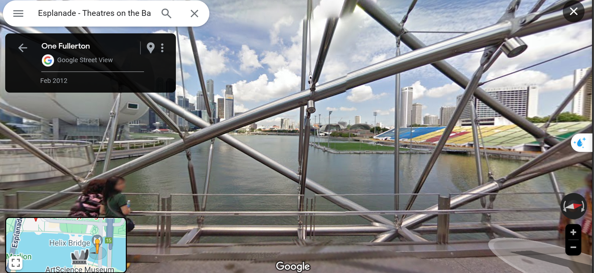

## Lost Tourist 	

### Infos About challenge : 

## solution:

### step 1 : Open The  image 

##### You notice that That place have special monument which are two coupols and a big   bulding

#### Take screenshot and entre it in google lens 

### step 2 : After the Step one you have information that maybe the place is in Signaor near to Esplanade theatres 

#### Go to google map tap "Esplanade theatres /  singapore " and do some search 

#### Advices 

##### You can notice from the picture of the tourist that is in a bridge and the theatre is right of his place 

# -------------------------------------------------------------------------------------------------------

### GOOGLE MAP 

#### search the near BRidge from the theatre 

### We can two Bridges "Helix" ,  " benajmin sheares"

### ------------------------------------------------------------------------------------------------------

### Set the 3d Google map feature in Helix Bridge 

### After some movements , you can notice that it's the location of the tourist 

### Flag:

### gigem{Helix_Bridge}
