# S4L1M --> #F4K3_RooT PLAYER

## Resistant

### Infos About challenge : 

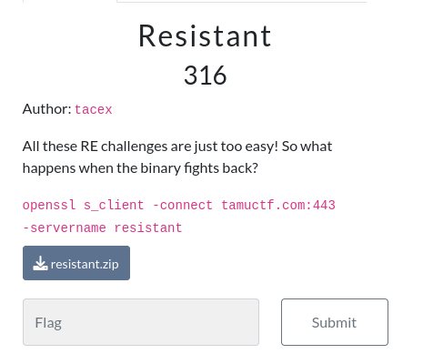

You can solve it Locally

## Solution:

## NOTICE : If you are not fimilar with debuging You should some basic knowledge To understand THis write_ups 
### step 1 : OPen The binary In ghidra or Ida to analyse it  

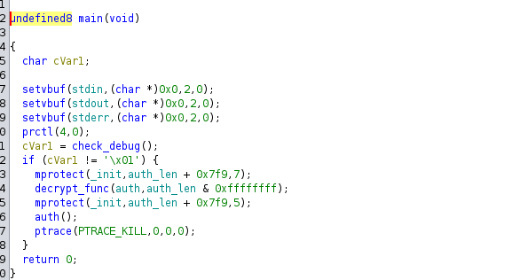

#### You can notice that exist function named "Check_debug"

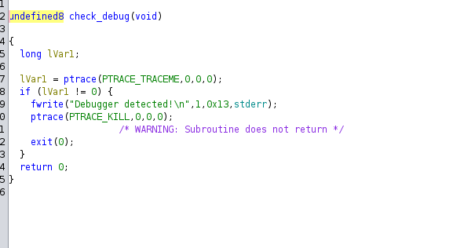

##### THis function check if debugger is present and retutn "Debugger detected" 

### Step 2 : Debug THis binary : I used GEF (GDB Kit) : 

##### First think you should notice that you should Run thee excuteble as Root to have acces to all resources such as syscalls 

#### Fist step is to skip the check_debug function by seting a breakpoint before its call ("call   0x5555555553a9 <check_debug>") and jump to the next instruction (skip )

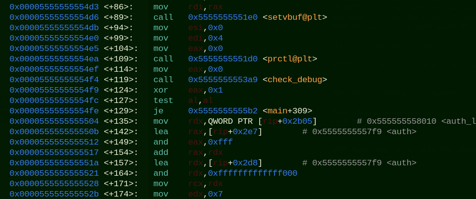

#### Making breakpoint 

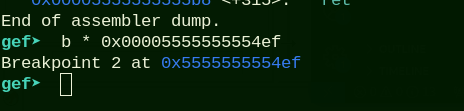

#### Skip

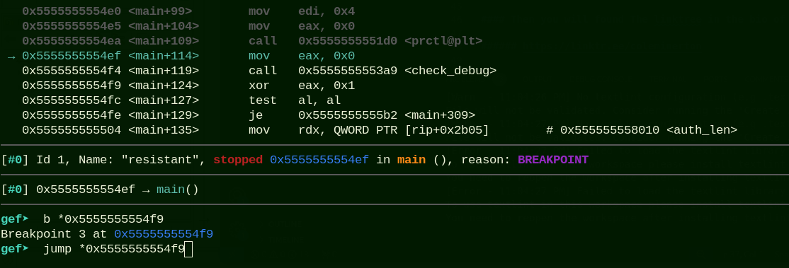

### Step 3 : Now it's the turn for your Reverse skills  :

##### After skiping the Anti-debugging function You can notice that the binary is crackme style 

#### So we should indetify where the program scan and where it's compare the input to the correct password 

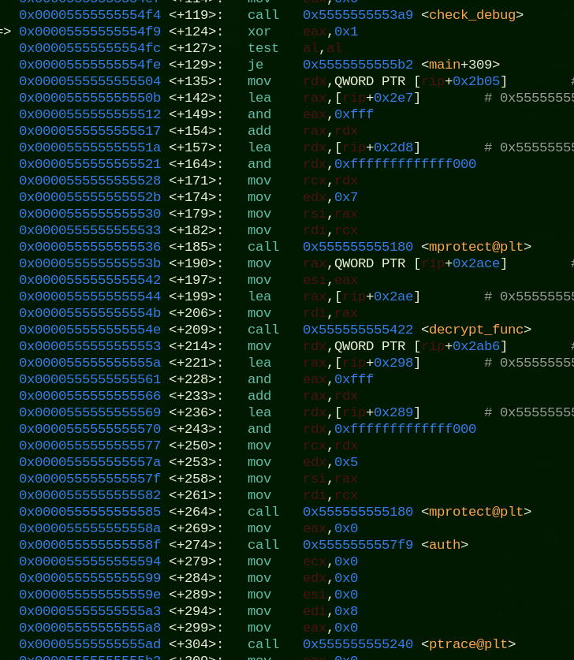

### After Reanalyse the binary you can notice that the programm check_debug after that it's decrypt the password after that it call a function named auth so we can predict that is the fucntion that scan the input and compare it to the password decrypted 

#### we can se its code by run "disassemble auth"

### NOTICE : First you should set breakpoint in the call auth instruction because you can't disassemble auth without excuting the mprotect fucntion  and then tap next in gef 

### Now you can run " disassemble auth "

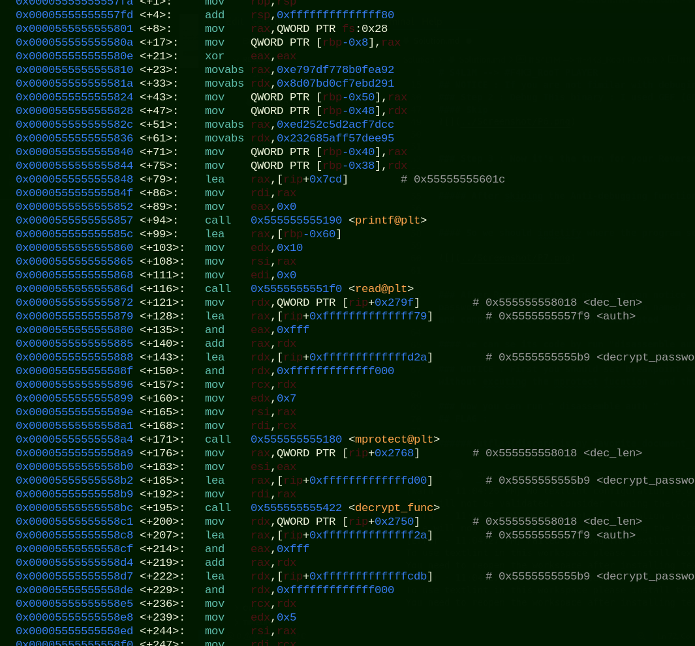

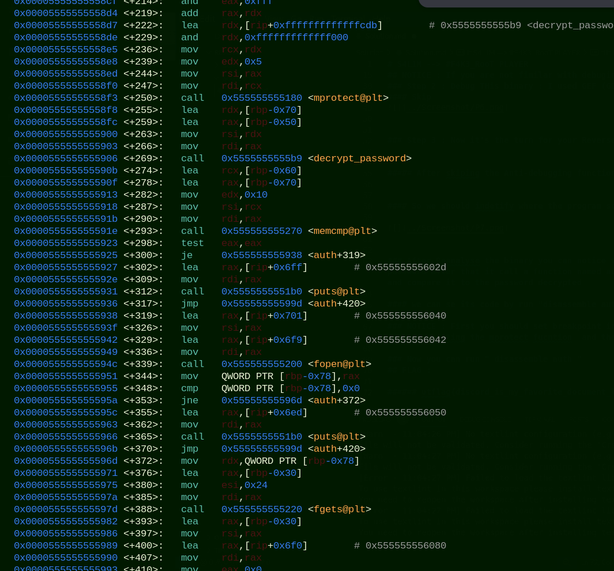

### You can see that the auth function  Printf a message then scan input then decrypt the password then compare it to our input 

### SO we should set Breakpoint in memcmp@alt and Excute the program 

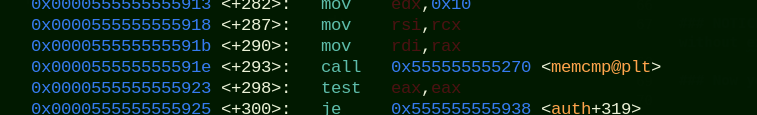

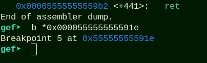

#### -------------------------------------------------

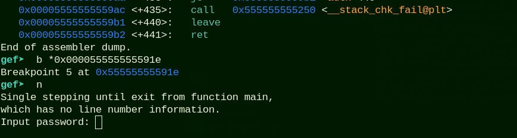

### Tap any input

#### After that you can see the value of registers before memcmp excute 

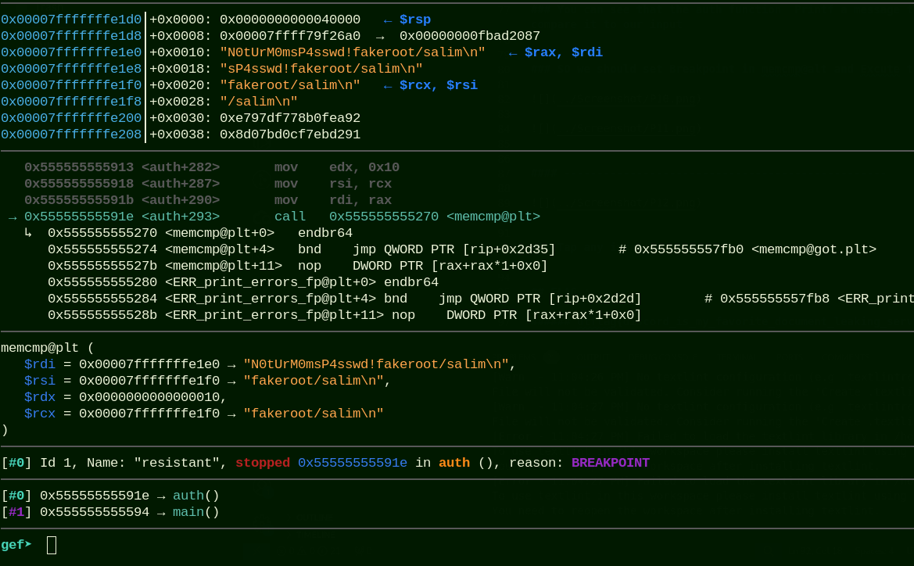

### and the real password is  : N0tUrM0msP4sswd! 

#### Go the description of the challenge and run the open ssl command : "openssl s_client -connect tamuctf.com:443 -servername resistant " and tap  "N0tUrM0msP4sswd! " 

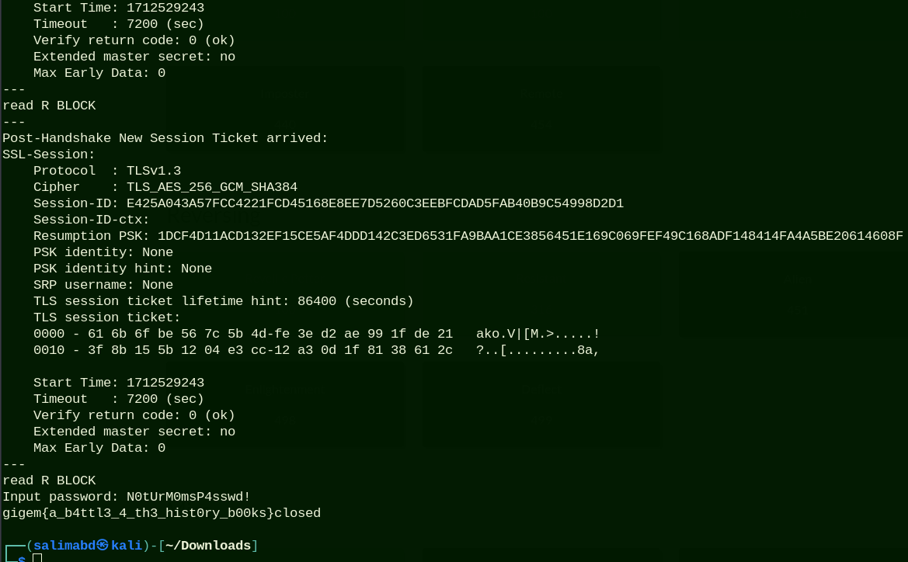

## FLAG : 

###### gigem{a_b4ttl3_4_th3_hist0ry_b00ks}
