## Reveille Petter	

### Infos About challenge : 

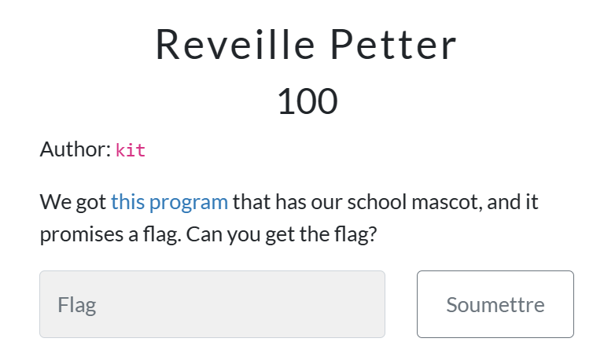

## solution:

## step 1 : Run the .exe 

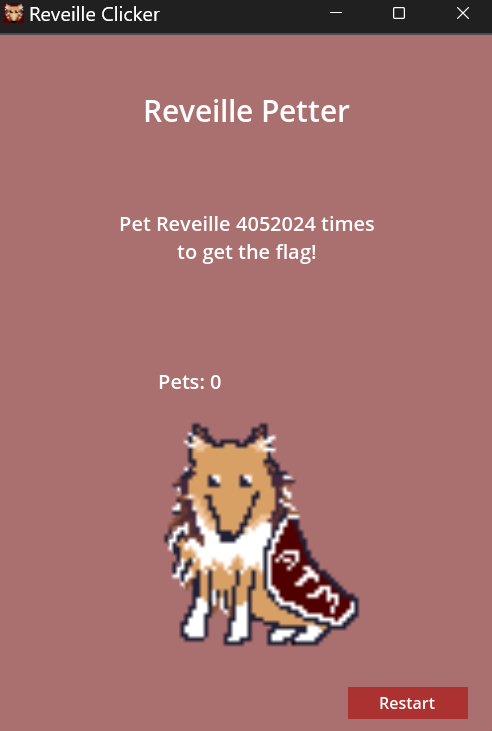

### You Can notice after Doing 10 pets "Peter is tired" 

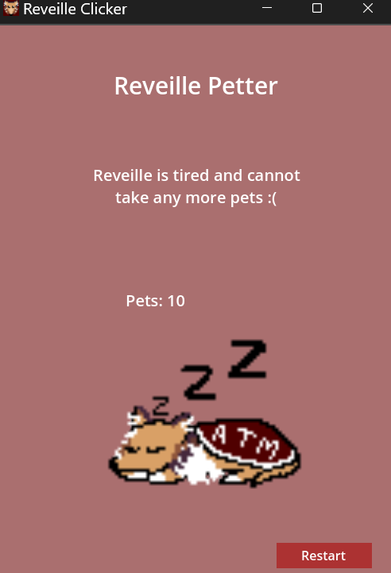

### YOU can Do some researche about our .exe And found that is Devlopped Using GodotEngine 

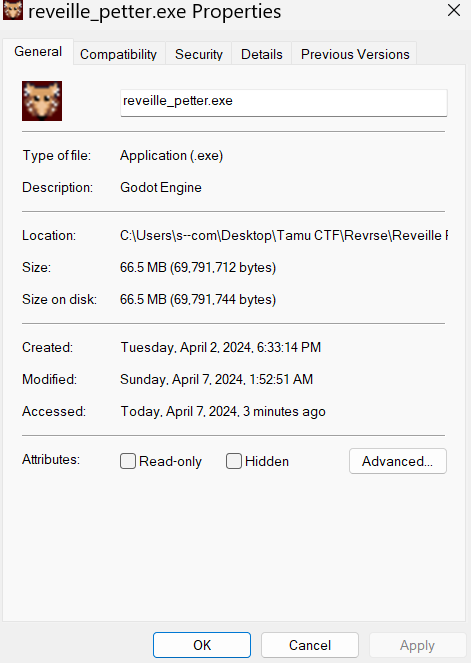

## Step 2 : Decompile Godot .exe 

### They Exit a tool name gdsdecomp that used to reverse GOdot programs and games 

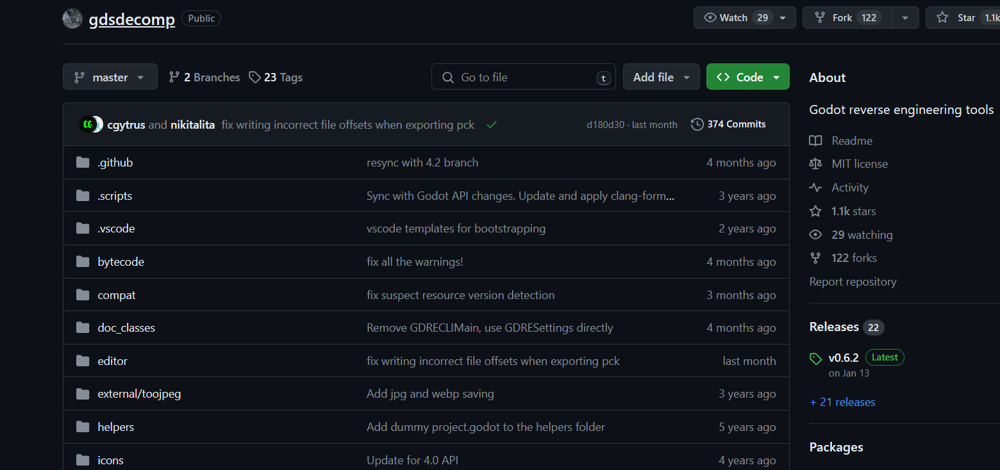

### Link : https://github.com/bruvzg/gdsdecomp 

#### Open The tool : 

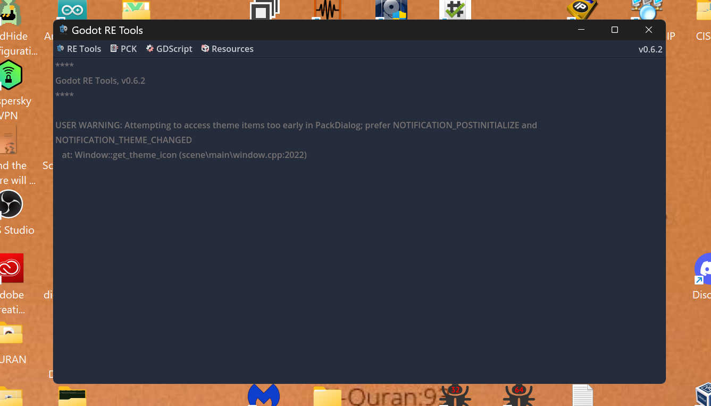

### Folow this steps to extract the source files of the game

### 1 - Click on "recover project"
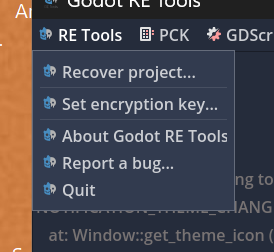

### 2 - choose you  Binary of the game  .exe 

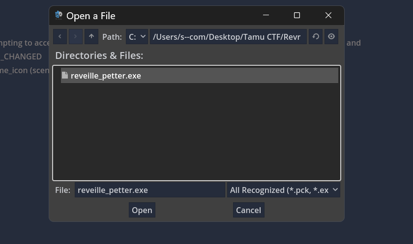

### 3 - choose you  Destination folder and press Extract

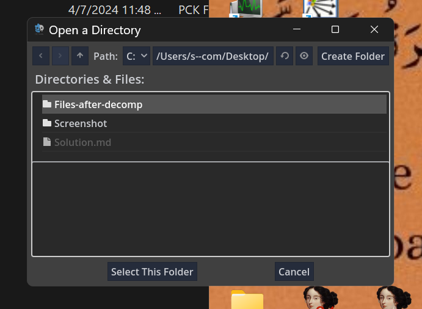

## Step 3 : Reverse and Patch The godot Project 

### Open the folder extracted from the last step in Godo-engine console

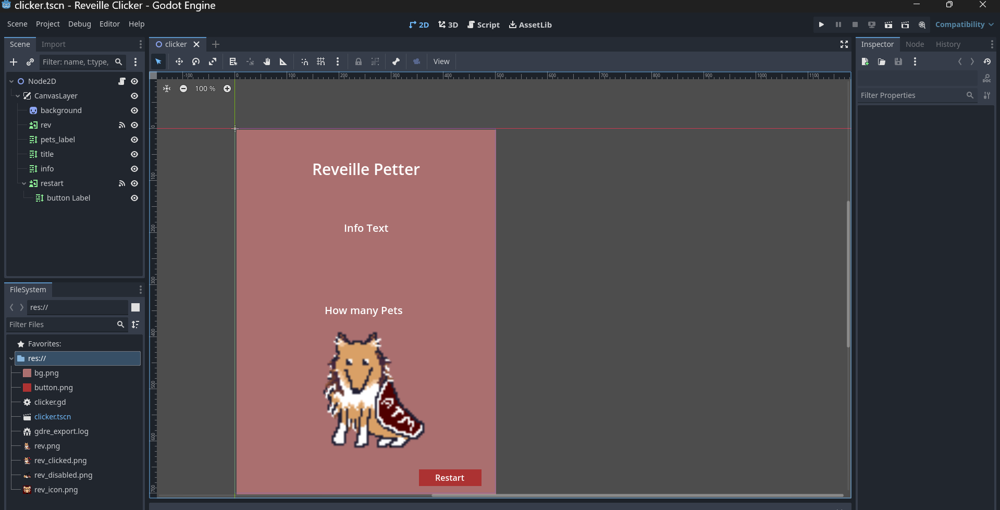

#### 1- You can Notice that we have file named clicker.gd 

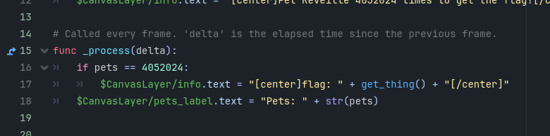

#### 2- You can notice tha this file has function name process that compare number of clicks if it is = 4052024 , it Print the flag 

### So we should change the value from  4052024  To 2 or value <10

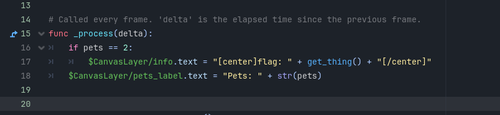

#### 3- Save and Run 

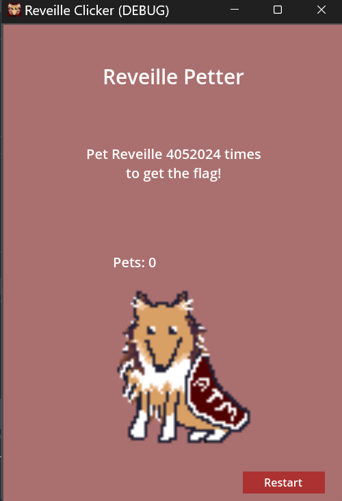

# -------------------------------------------------------------------------------------------------------------
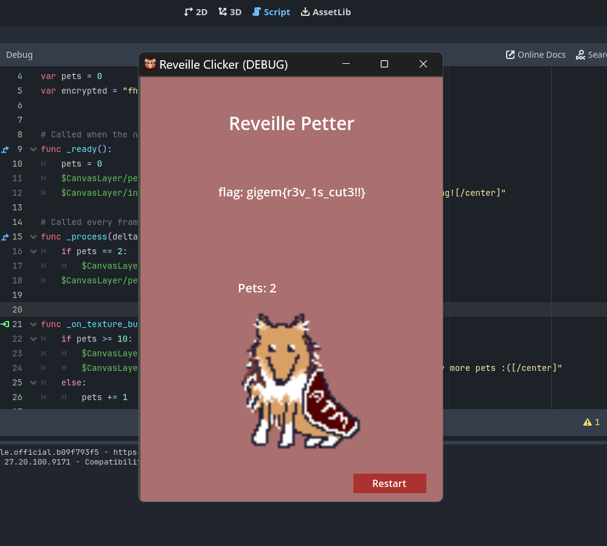

#### Congratulation  you are GODOT Expert

### Flag:

### gigem{r3v_1s_cut3!!}
